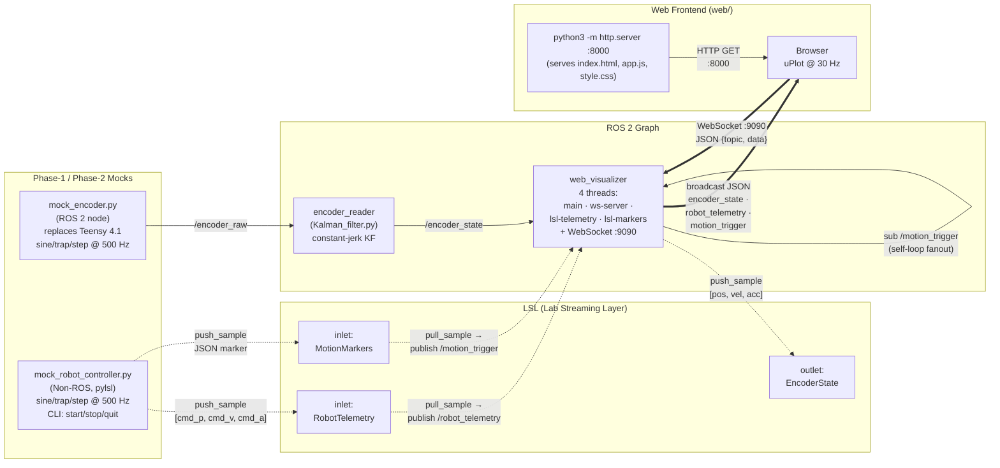

# claude_visualizer

A ROS 2 pipeline that streams Kalman-filtered encoder kinematics and robot-controller telemetry into a browser dashboard via **LSL (Lab Streaming Layer)** and a built-in **WebSocket** server. Currently running in *Phase-1 / Phase-2* mode with software mocks standing in for the Teensy 4.1 encoder and the real robot controller.

---

## File Structure

```
claude_visualizer_ws/
├── src/
│   ├── claude_visualizer/              # Main ROS 2 package (ament_cmake)
│   │   ├── claude_visualizer/          # Python package (ament-installed)
│   │   ├── config/
│   │   │   └── params.yaml             # All node parameters
│   │   ├── include/claude_visualizer/  # C++ headers
│   │   ├── launch/
│   │   │   └── bringup.launch.py       # Full-pipeline launch
│   │   ├── scripts/
│   │   │   ├── mock_encoder.py             # Phase-1 synthetic encoder (ROS node)
│   │   │   ├── Kalman_filter.py            # encoder_reader (ROS node, KF)
│   │   │   ├── web_visualizer.py           # LSL↔ROS bridge + WebSocket server
│   │   │   └── mock_robot_controller.py    # Non-ROS LSL publisher (Phase-2 stand-in)
│   │   ├── src/
│   │   │   └── cpp_node.cpp            # C++ example node
│   │   ├── CMakeLists.txt
│   │   └── package.xml
│   └── claude_visualizer_interface/    # Custom msg package
│       ├── msg/
│       │   ├── EncoderRaw.msg
│       │   ├── EncoderState.msg
│       │   ├── RobotTelemetry.msg
│       │   └── MotionTrigger.msg
│       ├── CMakeLists.txt
│       └── package.xml
├── web/                                # Browser frontend (static)
│   ├── index.html
│   ├── app.js
│   └── style.css
├── build/    install/    log/          # colcon artefacts (git-ignored)
└── .venv/                              # Python virtualenv (--system-site-packages)
```

---

## System Diagram



Legend: solid arrow = ROS topic (DDS) or HTTP, dashed = LSL push/pull, thick = WebSocket frames.

**Notes on the current system:**
- The bridge runs **four threads**: the ROS executor (main), an asyncio loop for the WebSocket server, and one blocking worker per LSL inlet. Cross-thread hand-off uses `asyncio.run_coroutine_threadsafe`.
- The bridge **subscribes to its own published topics** (`/robot_telemetry`, `/motion_trigger`) so any future ROS publisher of those topics is also broadcast to the browser — the LSL workers do not call `_broadcast` directly.
- `mock_robot_controller.py` is **not** in `bringup.launch.py`; it must be started in a separate terminal.
- The static frontend is served on a **different port** (`:8000`) by a separate process; the bridge only owns the WebSocket port (`:9090`).
- New WebSocket clients receive a **catch-up snapshot** (the cached most-recent message for each topic) on connect.

For a deep dive into the bridge's API, threading model, and the end-to-end sample journey, see [docs/web_visualizer_tutorial.md](docs/web_visualizer_tutorial.md).

---

## System Explanation (Need to revisit)

### Phase-1 / Phase-2 Mocks
- **`mock_encoder.py`** — ROS 2 node that stands in for the Teensy 4.1 + micro-ROS stack. Generates `sine`, `trapezoid`, or `step` position waveforms at 100 Hz with added Gaussian tick noise, and publishes on `/encoder_raw`.
- **`mock_robot_controller.py`** — *not* a ROS node. Pure Python + `pylsl`. Reads `config/params.yaml`, streams telemetry on the LSL outlet `RobotTelemetry`, and emits `START`/`STOP` JSON markers on `MotionMarkers` driven by stdin commands.

### ROS 2 Nodes
- **`encoder_reader`** (`Kalman_filter.py`) — constant-jerk Kalman filter. State vector `[position, velocity, acceleration, jerk]`, variable-`dt` transition matrix. Subscribes `/encoder_raw`, publishes `/encoder_state` with posterior variances and raw tick pass-through.
- **`web_visualizer`** — the *bridge* node. Three jobs:
  1. Subscribes `/encoder_state` and pushes it into an LSL outlet named `EncoderState` (so a non-ROS controller can consume it).
  2. Pulls LSL inlets `RobotTelemetry` and `MotionMarkers`, republishing them as `/robot_telemetry` and `/motion_trigger`.
  3. Runs a `websockets` server on port **9090** (`rosbridge_port` param, legacy name — no actual rosbridge runs), broadcasting every ROS message as a JSON envelope `{"topic": ..., "data": {...}}`. New clients receive the last-known message from each topic on connect.

### Topics & Messages (`claude_visualizer_interface/msg/`)
| Topic              | Type             | Producer              |
|--------------------|------------------|-----------------------|
| `/encoder_raw`     | `EncoderRaw`     | `mock_encoder`        |
| `/encoder_state`   | `EncoderState`   | `encoder_reader`      |
| `/robot_telemetry` | `RobotTelemetry` | `web_visualizer` (from LSL) |
| `/motion_trigger`  | `MotionTrigger`  | `web_visualizer` (from LSL) |

### LSL Streams
- `EncoderState` — 3 float channels: `position, velocity, acceleration` (outlet).
- `RobotTelemetry` — 3 float channels: `cmd_position, cmd_velocity, cmd_acceleration` (inlet).
- `MotionMarkers` — 1 string channel, irregular rate, JSON payload `{event, profile_id, label, expected_duration}` (inlet).

### Web Frontend
Plain HTML / JS (no framework). `app.js` opens a WebSocket to `ws://<host>:9090`, parses the JSON envelopes, keeps a 10 s rolling window (5000-sample cap), and redraws **uPlot** charts at 30 Hz decoupled from the message rate.
- **Live panel** — position, velocity, acceleration streams.
- **Profile panel** — activated by a `START` motion trigger; overlays estimated vs. commanded position and velocity with profile ID, label, elapsed and expected duration.
- Controls: Pause/Resume, Clear, and a connection status dot with auto-reconnect.

---

## How to Run

### Prerequisites — order matters

```bash
# 1. Source ROS 2 first so rclpy/colcon/rosidl tooling are on PATH
source /opt/ros/<distro>/setup.bash          # humble / iron / jazzy

# 2. Activate the workspace venv (created with --system-site-packages so
#    rclpy and other ROS Python packages remain visible inside the venv).
#    If the venv does not exist yet:
#      python3 -m venv --system-site-packages .venv
source .venv/bin/activate

# 3. Install Python deps into the venv (first time only)
pip install pylsl websockets numpy pyyaml
```

> **Why the venv?** Pinning the same interpreter for `colcon`, for Python-shebang scripts installed by CMake, and for `pip install` avoids the classic "works in one terminal, not the other" mismatch.

### Build

```bash
cd ~/Projects/claude_visualizer_ws
colcon build --symlink-install
source install/setup.bash
```

### Full pipeline (recommended)

```bash
ros2 launch claude_visualizer bringup.launch.py
# optional waveform override:
ros2 launch claude_visualizer bringup.launch.py waveform:=sine
# optional WS port override (default 9090):
ros2 launch claude_visualizer bringup.launch.py rosbridge_port:=9090
```

This launches `mock_encoder`, `encoder_reader`, and `web_visualizer` together.

### Run the non-ROS LSL controller mock

`mock_robot_controller.py` is **not** in the launch file — it's a standalone process. Start it in a separate terminal once the pipeline is up:

```bash
# Direct invocation
python3 src/claude_visualizer/scripts/mock_robot_controller.py --waveform trapezoid

# Or through ros2 run (after colcon build)
ros2 run claude_visualizer mock_robot_controller.py -- --waveform sine

# Interactive commands: start | stop | quit
```

### Open the dashboard

```bash
cd web
python3 -m http.server 8000
# Then browse to http://localhost:8000
# The page auto-connects to ws://localhost:9090.
```

### Phase-1 debug rollback

To verify only `mock_encoder` + Kalman filter (e.g. for KF tuning in PlotJuggler), comment out `web_visualizer_node` in `src/claude_visualizer/launch/bringup.launch.py`. Nothing else needs to change.

---

## Dependencies

### ROS 2 packages (from `package.xml`)
- **Build tools:** `ament_cmake`, `ament_cmake_python`, `rosidl_default_generators`
- **Runtime:** `rclcpp`, `rclpy`, `std_msgs`, `builtin_interfaces`, `claude_visualizer_interface`
- **Lint/test:** `ament_lint_auto`, `ament_lint_common`

Expected ROS 2 distro: package format is 3 → **Humble / Iron / Jazzy** (no distro pinned in package files).

### Python packages (pip, not rosdep-managed)
| Package      | Used by                                       |
|--------------|-----------------------------------------------|
| `pylsl`      | `web_visualizer.py`, `mock_robot_controller.py` |
| `websockets` | `web_visualizer.py` (built-in WS server)       |
| `numpy`      | `mock_encoder.py`, `Kalman_filter.py`          |
| `PyYAML`     | `mock_robot_controller.py` (reads `params.yaml`) |

```bash
# One-shot install into the activated venv
pip install pylsl websockets numpy pyyaml
```

### Frontend (CDN-loaded, no install needed)
- [uPlot 1.6.30](https://github.com/leeoniya/uPlot) via jsdelivr.

### System
- **Python** 3.12.x (matches the venv used during development).
- **liblsl** — the native library backing `pylsl`. On Ubuntu 22.04+:
  ```bash
  sudo apt install liblsl-dev   # or install the labstreaminglayer release deb
  ```
