# `web_visualizer` & `mock_robot_controller` — Tutorial

> **Who this is for.** You know ROS 2 in Python (topics, callbacks, msg types) and you're comfortable with OOP in Python or C++. You've never written a webpage, never read `async def`, and "WebSocket vs HTTP" is a phrase you've heard but never had to care about. By the end of this document you should be able to read both files line-by-line, modify either of them, and predict what will break when you do.
>
> **Two files we're teaching.**
> - [src/claude_visualizer/scripts/web_visualizer.py](../src/claude_visualizer/scripts/web_visualizer.py) — a ROS 2 node that bridges three worlds: ROS, LSL, and a browser.
> - [src/claude_visualizer/scripts/mock_robot_controller.py](../src/claude_visualizer/scripts/mock_robot_controller.py) — a synthetic LSL publisher that pretends to be a robot controller. **NOT a ROS node.**

---

## Table of contents

1. [What is this thing, in one picture?](#1-what-is-this-thing-in-one-picture)
2. [The 30-second vocabulary list](#2-the-30-second-vocabulary-list)
3. [The `pip` world vs the `apt`/`colcon` world](#3-the-pip-world-vs-the-aptcolcon-world)
4. [Ports, hosts, `0.0.0.0` — what does the bridge listen on?](#4-ports-hosts-0000--what-does-the-bridge-listen-on)
5. [WebSocket from scratch — build it like a car](#45-websocket-from-scratch--build-it-like-a-car)
6. [Lab Streaming Layer in 5 minutes](#5-lab-streaming-layer-in-5-minutes)
6. [Reading `mock_robot_controller.py` end-to-end](#6-reading-mock_robot_controllerpy-end-to-end)
7. [Why `web_visualizer.py` needs threads at all](#7-why-web_visualizerpy-needs-threads-at-all)
8. [`asyncio` in just enough depth to read this file](#8-asyncio-in-just-enough-depth-to-read-this-file)
9. [Reading `web_visualizer.py` end-to-end](#9-reading-web_visualizerpy-end-to-end)
10. [One sample's journey: end-to-end sequence](#10-one-samples-journey-end-to-end-sequence)
11. [Run it, change it, debug it](#11-run-it-change-it-debug-it)
12. [Stretch exercises](#12-stretch-exercises)
- [Appendix A — Cheat-sheet card](#appendix-a--cheat-sheet-card)
- [Appendix B — Glossary](#appendix-b--glossary)

---

## 1. What is this thing, in one picture?

`web_visualizer.py` is a **bridge process** that connects three worlds in one Python program:

- **ROS 2 topics** (the world you already know).
- **LSL** (Lab Streaming Layer — a non-ROS pub/sub bus used by neuro/robotics tools).
- **A browser tab** (the live-plot dashboard).

`mock_robot_controller.py` is a small standalone process that publishes two LSL streams that pretend to be a real robot controller's command output. It exists so you can develop the bridge before the real controller code is written.

Here is the entire system:

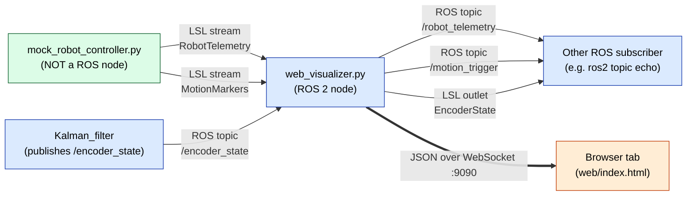

The four flows above are exactly what the docstring at [web_visualizer.py:6-22](../src/claude_visualizer/scripts/web_visualizer.py#L6-L22) describes. We're going to unpack every word of that docstring over the next 11 sections.

**Where the files live on disk:**

```
claude_visualizer_ws/
├── src/claude_visualizer/scripts/
│   ├── web_visualizer.py          ← the bridge (ROS node)
│   └── mock_robot_controller.py   ← synthetic LSL publisher
└── web/                           ← the browser frontend (sibling, NOT inside the node)
    ├── index.html
    └── app.js
```

The frontend (`web/`) is **not** embedded in the Python node. It's plain HTML/JS files served by a separate HTTP server. The Python node only speaks WebSocket to the browser, never HTTP.

> **Try this first.** Before reading further, run `ros2 launch claude_visualizer bringup.launch.py`, then in another terminal start `mock_robot_controller.py`, then open `http://localhost:8000` in a browser. Just watch the line wiggle. Then come back. (Full instructions are in [§11](#11-run-it-change-it-debug-it).)

---

## 2. The 30-second vocabulary list

You will encounter four foreign words on every other page. Here they are, defined the way a ROS developer needs to hear them:

| Term | If you know ROS, think… | First appears in |
|---|---|---|
| **LSL outlet / inlet** | A `Publisher` / `Subscription` on a separate, non-ROS bus. There is no roscore — outlets advertise themselves on the LAN, inlets find them by name. | [mock_robot_controller.py:97-122](../src/claude_visualizer/scripts/mock_robot_controller.py#L97-L122), [web_visualizer.py:229-242](../src/claude_visualizer/scripts/web_visualizer.py#L229-L242) |
| **WebSocket** | A long-lived TCP connection that carries JSON frames in both directions. Like a topic where the subscriber happens to be a browser. Compare to HTTP, where each request opens & closes a connection. | [web_visualizer.py:195-225](../src/claude_visualizer/scripts/web_visualizer.py#L195-L225) |
| **`asyncio`** | A single-threaded cooperative scheduler. Like an executor that only runs one callback at a time, but every callback is allowed to **pause itself** mid-way (with `await`) and let another one run. The `websockets` library requires this. | [web_visualizer.py:189-225](../src/claude_visualizer/scripts/web_visualizer.py#L189-L225) |
| **frontend** | The HTML/JS files in [web/](../web/) that draw the live plot. Runs in Chrome, not inside the Python process. Equivalent to "the GUI half of an `rqt_plot` plugin, except it lives in a browser tab." | [web/index.html](../web/index.html), [web/app.js](../web/app.js) |

### HTTP vs WebSocket — why we need WebSocket at all

HTTP is request/response: the client asks, the server answers, the connection closes. To get live data, the client would have to poll (ask repeatedly), which wastes everyone's time.

WebSocket starts as a normal HTTP request, then **upgrades** to a persistent two-way pipe that stays open for hours. After the handshake, either side can send messages whenever they have something to say.

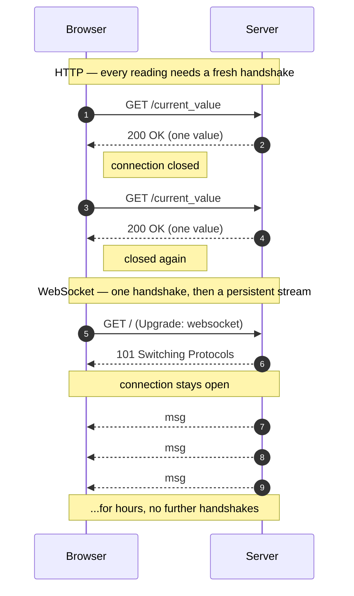

That's why a real-time dashboard uses WebSocket and not HTTP polling.

---

## 3. The `pip` world vs the `apt`/`colcon` world

This codebase mixes packages from two ecosystems. The confusion is real — let's resolve it once.

| Ecosystem | Installed by | Found via | In our code |
|---|---|---|---|
| **ROS 2** | `apt` / `colcon build` | `ament_index_python`, `import rclpy` | `rclpy`, `rclpy.node`, `claude_visualizer_interface.msg` |
| **Plain Python** | `pip install` | normal `import` | `pylsl`, `websockets`, `yaml` |
| **Standard library** | ships with Python | normal `import` | `asyncio`, `json`, `threading`, `argparse`, `time` |

Look at the import block of `web_visualizer.py`, annotated:

```python
# web_visualizer.py:43-54
import asyncio                     # ← stdlib
import json                        # ← stdlib
import threading                   # ← stdlib

import rclpy                       # ← ROS 2 (installed via apt or rosdep)
from rclpy.node import Node        # ← ROS 2
from rclpy.qos import QoSProfile, ReliabilityPolicy, HistoryPolicy  # ← ROS 2

import pylsl                       # ← pip install pylsl
import websockets                  # ← pip install websockets

from claude_visualizer_interface.msg import EncoderState, RobotTelemetry, MotionTrigger
                                   # ← built by colcon from msg/ definitions
```

The line `pip install pylsl websockets` is literally written into the docstring at [web_visualizer.py:40](../src/claude_visualizer/scripts/web_visualizer.py#L40). If you're running in a Python venv, run it once.

> **Try this.** Compare the install locations side-by-side:
> ```bash
> python3 -c "import pylsl; print(pylsl.__file__)"
> ros2 pkg prefix claude_visualizer_interface
> ```
> The first prints something like `~/.local/lib/python3.x/site-packages/pylsl/__init__.py` (a pip-installed library). The second prints your colcon install dir. They live in completely separate worlds — Python doesn't care.

---

## 4. Ports, hosts, `0.0.0.0` — what does the bridge listen on?

A networking primer in 60 seconds, in language that maps to what you already know.

| Term | Plain-English definition | ROS analogy |
|---|---|---|
| **Port** | A number (0–65535) the OS uses to route TCP traffic to a specific process. | Like a topic name, but at the OS level: two processes can't both bind to port 9090 just like two publishers can't own the same topic. |
| **`127.0.0.1`** (a.k.a. `localhost`) | The loopback address. Reachable only from this machine. | Like a topic only visible inside one process. |
| **`0.0.0.0`** | "Bind on **every** network interface" — wifi, ethernet, loopback, the lot. Anyone who can reach this machine can connect. | Like a topic that's also visible to other machines on your ROS_DOMAIN_ID. |
| **`ws://` vs `http://`** | Same TCP underneath; different protocol on top. The `ws://` scheme tells the browser "speak the WebSocket protocol after the handshake." | — |

**Two ports actually in play in this project:**

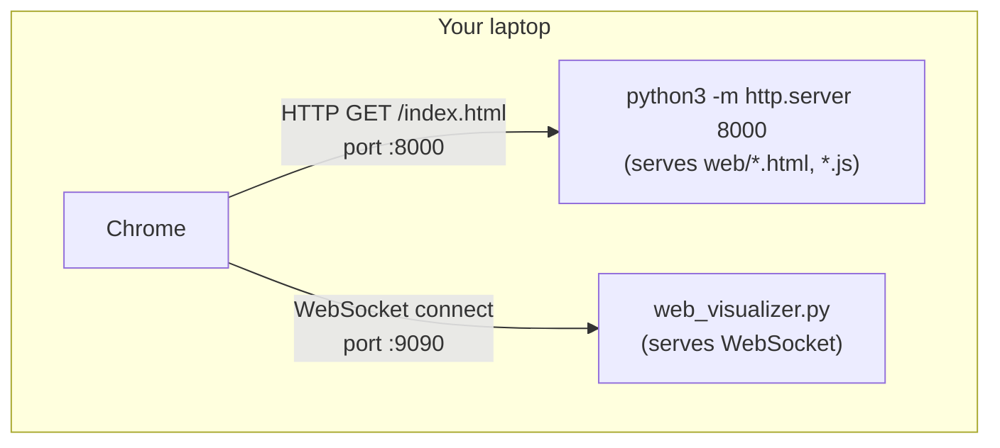

- **Port 8000** — a tiny HTTP server (e.g. `python3 -m http.server`) hands the browser the static `.html`, `.js`, `.css` files. **`web_visualizer.py` does NOT do this.**
- **Port 9090** — `web_visualizer.py`'s WebSocket server. The browser opens a persistent connection here for live data.

The two relevant lines in the bridge:

```python
# web_visualizer.py:116-117
self.declare_parameter("rosbridge_port", 9090)   # legacy name kept; this is the WebSocket port
self.declare_parameter("ws_host", "0.0.0.0")     # bind on every interface
```

```python
# web_visualizer.py:195-198
async def _start_ws_server(self) -> None:
    self._ws_server = await websockets.serve(
        self._handle_client, self._ws_host, self._ws_port,
    )
```

That's the whole server. `websockets.serve` opens the listener; `_handle_client` is the coroutine that runs *once per connected browser*.

And on the browser side:

```javascript
// web/app.js:4
const WS_URL = `ws://${location.hostname || "localhost"}:9090`;
```

So the client *names the same port* that the server bound. Change one and you must change the other.

> **Try this.** Edit [params.yaml](../src/claude_visualizer/config/params.yaml) and change `rosbridge_port: 9090` to `9091`. Restart everything. The browser will fail to connect (open Chrome DevTools → Console → see the WebSocket error). Now change `WS_URL` in `app.js` to `:9091`, refresh — it works again. You've just demonstrated *why* the two numbers must match.

---

## 4.5. WebSocket from scratch — build it like a car

This section teaches WebSocket as a **general technology**, using a three-step framework:

1. **The parts** — what components does a WebSocket server need to exist?
2. **The assembly** — how do you snap those parts together in Python? (a minimal example, unrelated to `web_visualizer.py`)
3. **The configuration** — how does `web_visualizer.py` customize those parts for its specific job?

Read this once and you will be able to write a WebSocket server from scratch. Then reading `web_visualizer.py` is just checking which choices it made.

---

### Step 1 — The parts (what a WebSocket server is made of)

A car needs four things to exist as a car: chassis, engine, wheels, and transmission. A WebSocket server also needs exactly four things:

| Part | Car equivalent | What it does |
|---|---|---|
| **Listener** | The chassis — the skeleton everything attaches to | Binds to a port and waits for browser connections |
| **Connection handler** | The engine — does the actual work when something happens | A function that runs *once per browser*, receiving and sending messages |
| **Client roster** | The passenger list — who's on board | A container (usually a `set`) tracking every currently-connected browser |
| **Message sender** | The horn — pushes a signal out to all passengers | A function that iterates the roster and sends the same message to every client |

Without **any one** of these four parts, you don't have a working WebSocket server. With all four, you have everything you need — regardless of what the messages contain.

> A WebSocket **connection** is a persistent, two-way pipe between one browser tab and one server. It's opened once (via an HTTP "upgrade" handshake that you never see) and then stays open. Both sides can send at any time, until one side explicitly closes it — unlike plain HTTP, which is closed immediately after each response.

---

### Step 2 — The assembly (a minimal WebSocket server)

Here is the smallest possible WebSocket server in Python, using the `websockets` library. It echoes every message back to all connected browsers. It has **nothing to do with ROS or LSL** — it just demonstrates how the four parts snap together.

```python
# minimal_ws_server.py — run this standalone: python3 minimal_ws_server.py
import asyncio
import websockets

# ── Part 3: Client roster ──────────────────────────────────────────────────
connected_clients = set()

# ── Part 2: Connection handler ─────────────────────────────────────────────
async def handle_connection(websocket):
    """Called once per browser tab that connects."""
    connected_clients.add(websocket)          # register this browser
    try:
        async for message in websocket:       # wait for each message FROM the browser
            print(f"received: {message}")
            websockets.broadcast(connected_clients, message)  # echo to all
    except websockets.ConnectionClosed:
        pass                                  # browser tab closed — normal
    finally:
        connected_clients.discard(websocket)  # unregister on disconnect

# ── Part 1: Listener ───────────────────────────────────────────────────────
async def main():
    async with websockets.serve(handle_connection, "0.0.0.0", 8765):
        await asyncio.Future()               # run forever

asyncio.run(main())
```

Read each section label in that snippet and match it to the table in Step 1:

- **Listener** → `websockets.serve(handle_connection, "0.0.0.0", 8765)` — binds port 8765, calls `handle_connection` for every new browser
- **Connection handler** → `async def handle_connection(websocket)` — the one function that does all the per-browser work
- **Client roster** → `connected_clients = set()` — a plain Python `set` that grows and shrinks as browsers join and leave
- **Message sender** → `websockets.broadcast(connected_clients, message)` — one call, sends to all

**That is it.** Every WebSocket server, from this 30-line toy to production systems, is a variation of these four parts. What changes between projects is:
- What you *do* with incoming messages (here: echo them; in `web_visualizer.py`: ignore them)
- What triggers an *outgoing* message (here: an incoming message; in `web_visualizer.py`: a ROS callback or LSL sample)
- Where you put the listener in your program (here: in `main()`; in `web_visualizer.py`: in a background thread)

---

### Step 3 — The configuration (how `web_visualizer.py` customizes the four parts)

Now look at the same four parts in `web_visualizer.py` and see what choices were made:

**Part 1 — Listener**

```python
# web_visualizer.py:225-228
async def _start_ws_server(self) -> None:
    self._ws_server = await websockets.serve(
        self._handle_client,   # ← the connection handler (Part 2)
        self._ws_host,         # ← "0.0.0.0" from params.yaml — all interfaces
        self._ws_port,         # ← 9090 from params.yaml
    )
```

Same call as in the minimal example. The only differences are: it's a method (not a module-level function), the port comes from a ROS parameter, and it's wrapped in `await` because `web_visualizer.py` uses a separate asyncio loop (explained in §8).

**Part 2 — Connection handler**

```python
# web_visualizer.py:230-244
async def _handle_client(self, websocket) -> None:
    # Send the cached snapshot so the page isn't blank.
    for cached in self._ws_last_messages.values():
        await websocket.send(cached)      # push the last-known state immediately
    self._ws_clients.add(websocket)       # register in the roster (Part 3)
    try:
        async for _ in websocket:
            pass                          # ignore browser → server messages (read-only dashboard)
    except websockets.ConnectionClosed:
        pass
    finally:
        self._ws_clients.discard(websocket)  # unregister on disconnect
```

Compare this to `handle_connection` in the minimal example. Same structure:
1. Register → do work → unregister on disconnect.

The only additions are: send a cached snapshot on connect (so the page isn't blank), and ignore incoming messages (a dashboard only *receives* live data; it never sends commands back).

**Part 3 — Client roster**

```python
# web_visualizer.py:165
self._ws_clients = set()   # grows when a tab connects, shrinks when it disconnects
```

Identical to `connected_clients` in the minimal example. The difference: it's an instance variable (`self._`) because `web_visualizer.py` is a class.

**Part 4 — Message sender**

```python
# web_visualizer.py:246-257
def _broadcast(self, payload: dict) -> None:
    message = json.dumps(payload)                       # serialize the data
    self._ws_last_messages[payload["topic"]] = message  # cache for late-joining browsers
    if self._ws_clients:
        asyncio.run_coroutine_threadsafe(               # schedule from a non-asyncio thread
            self._broadcast_async(message),
            self._ws_loop_scheduler,
        )

async def _broadcast_async(self, message: str) -> None:
    if self._ws_clients:
        websockets.broadcast(self._ws_clients, message) # ← same call as in the minimal example
```

The final call — `websockets.broadcast(...)` — is identical to the minimal example. What's new is the **two-step wrapper**:

1. `_broadcast` is a **plain function** callable from any thread (ROS callbacks, LSL worker threads).
2. `_broadcast_async` is an **async function** that actually executes the broadcast inside the asyncio loop.
3. `asyncio.run_coroutine_threadsafe(...)` is the bridge between them — "schedule this async call from outside the asyncio world."

This wrapper exists because `web_visualizer.py` receives data on multiple threads (see §7) while the WebSocket library requires all sends to happen on the asyncio loop thread. In the minimal example there's only one thread, so you can call `websockets.broadcast` directly. In a multi-threaded program you can't.

---

### The full picture side-by-side

| Part | Minimal example | `web_visualizer.py` | Difference |
|---|---|---|---|
| Listener | `websockets.serve(handler, "0.0.0.0", 8765)` | `websockets.serve(_handle_client, host, port)` at :225 | Port from params; runs inside asyncio thread |
| Connection handler | `async def handle_connection(ws)` | `async def _handle_client(self, ws)` at :230 | Sends snapshot on connect; ignores incoming |
| Client roster | `connected_clients = set()` | `self._ws_clients = set()` at :165 | Instance variable; same data structure |
| Message sender | `websockets.broadcast(clients, msg)` | `_broadcast()` → `run_coroutine_threadsafe` → `_broadcast_async()` at :246 | Thread-safe wrapper needed because of multi-threading |

> **Key insight.** The WebSocket library (`websockets`) itself is always the same. The four parts are always the same. What changes is where those parts live in your program and how you call the message sender when your program has multiple threads.

---

## 5. Lab Streaming Layer in 5 minutes

LSL is a real-time pub/sub bus. It's used heavily in neuroscience and HCI labs because it's **language-agnostic** (C++, Python, MATLAB, Java all speak it) and needs no central master process. Streams advertise themselves over LAN multicast; subscribers find them by name.

There are five operations you need to recognize. Here they are with their ROS equivalents:

| Action | ROS 2 (`rclpy`) | LSL (`pylsl`) |
|---|---|---|
| **Declare a stream type** | `.msg` file + `create_publisher(MyMsg, topic, qos)` | `pylsl.StreamInfo(name, type, n_channels, srate, fmt)` |
| **Publish** | `pub.publish(msg)` | `outlet.push_sample([f1, f2, f3])` |
| **Subscribe** | `create_subscription(MyMsg, topic, callback, qos)` | two-step: `streams = resolve_byprop("name", "Foo")` then `inlet = StreamInlet(streams[0])` |
| **Receive** | callback is invoked by the executor | blocking `sample, ts = inlet.pull_sample(timeout=1.0)` (returns `(None, _)` on timeout) |
| **Discovery** | DDS / ROS graph | LAN multicast — `resolve_byprop` polls until something replies |

There is no `.msg` file in LSL — the schema is just the channel count and the channel format (float, int, string, …) that you pass to `StreamInfo`.

### Building an outlet (regular rate, fixed-channel float stream)

```python
# mock_robot_controller.py:97-110
def build_telemetry_outlet(rate_hz: float) -> pylsl.StreamOutlet:
    info = pylsl.StreamInfo(
        name="RobotTelemetry",
        type="ControlSignal",
        channel_count=3,
        nominal_srate=rate_hz,
        channel_format=pylsl.cf_float32,
        source_id="mock_robot_controller_telemetry",
    )
    channels = info.desc().append_child("channels")
    for label in ("cmd_position", "cmd_velocity", "cmd_acceleration"):
        ch = channels.append_child("channel")
        ch.append_child_value("label", label)
    return pylsl.StreamOutlet(info)
```

Read this top-down:

- `name="RobotTelemetry"` — what subscribers will look for.
- `channel_count=3` and `channel_format=pylsl.cf_float32` — the wire schema is "three 32-bit floats per sample," forever. Change this and every subscriber breaks.
- `nominal_srate=rate_hz` — for *regular* streams. Tells consumers "I plan to publish at this rate." It's a hint, not a guarantee.
- The `desc().append_child("channels")` block adds human-readable labels — pure metadata, optional.

### Building an outlet (irregular, string-typed event stream)

```python
# mock_robot_controller.py:113-122
def build_marker_outlet() -> pylsl.StreamOutlet:
    info = pylsl.StreamInfo(
        name="MotionMarkers",
        type="Markers",
        channel_count=1,
        nominal_srate=pylsl.IRREGULAR_RATE,
        channel_format=pylsl.cf_string,
        source_id="mock_robot_controller_markers",
    )
    return pylsl.StreamOutlet(info)
```

Two things differ from the telemetry outlet:

- `nominal_srate=pylsl.IRREGULAR_RATE` — "events arrive whenever; no fixed rate."
- `channel_format=pylsl.cf_string` — payload is a string. We will stuff a JSON document into that string.

### Pushing a sample

A regular sample (one tick of the 500 Hz stream):

```python
# mock_robot_controller.py:225
outlet.push_sample([float(p), float(v), float(a)])
```

An event sample (a START or STOP marker):

```python
# mock_robot_controller.py:237-245
def push_marker(outlet: pylsl.StreamOutlet, event: str, profile_id: str,
                label: str = "cli", expected_duration: float = 0.0) -> None:
    payload = {
        "event": event,
        "profile_id": profile_id,
        "label": label,
        "expected_duration": expected_duration,
    }
    outlet.push_sample([json.dumps(payload)])
```

Note the `[json.dumps(payload)]` — even a single-channel string outlet expects a **list** of values, so we wrap our JSON string in a one-element list.

### Resolving + pulling on the inlet side

```python
# web_visualizer.py:325-334
def _resolve_stream(self, name: str, timeout: float):
    self.get_logger().info(f"Resolving LSL stream '{name}' (timeout={timeout}s)…")
    streams = pylsl.resolve_byprop("name", name, timeout=timeout)
    if not streams:
        self.get_logger().warn(
            f"LSL stream '{name}' not found — will keep retrying"
        )
        return None
    self.get_logger().info(f"LSL stream '{name}' resolved.")
    return pylsl.StreamInlet(streams[0])
```

`resolve_byprop("name", "RobotTelemetry", timeout=5.0)` says "look on the LAN for any LSL stream whose `name` field matches; wait up to 5 seconds." If multiple matches exist, you pick one (here, `streams[0]`). Then you wrap it in a `StreamInlet` to actually receive samples.

Pulling a float sample:

```python
# web_visualizer.py:266-272
try:
    sample, _ = inlet.pull_sample(timeout=1.0)
except Exception as e:
    self.get_logger().warn(f"[telemetry] pull_sample error: {e}")
    inlet = None
    continue
if sample is None:
    continue
```

`pull_sample(timeout=1.0)` blocks for up to 1 second waiting for data. On success it returns `(sample_list, lsl_timestamp)`; on timeout it returns `(None, _)`. **This is a blocking call** — that's why it lives in its own thread (we'll get to that in [§7](#7-why-web_visualizerpy-needs-threads-at-all)).

Pulling a string sample (markers):

```python
# web_visualizer.py:298-311
try:
    sample, _ = inlet.pull_sample(timeout=1.0)
except Exception as e:
    self.get_logger().warn(f"[markers] pull_sample error: {e}")
    inlet = None
    continue
if not sample:
    continue

raw = sample[0]
try:
    payload = json.loads(raw)
except (TypeError, ValueError):
    payload = {"event": "LABEL", "label": str(raw)}
```

Same call, but now `sample[0]` is a string — we parse it as JSON, falling back to a generic LABEL if it's not valid JSON.

> **Try this.** Open two terminals.
> - Terminal A: `python3 src/claude_visualizer/scripts/mock_robot_controller.py --waveform sine`
> - Terminal B: a one-shot LSL listener:
>   ```python
>   import pylsl
>   streams = pylsl.resolve_byprop("name", "RobotTelemetry", timeout=5.0)
>   inlet = pylsl.StreamInlet(streams[0])
>   for _ in range(20):
>       sample, ts = inlet.pull_sample(timeout=1.0)
>       print(ts, sample)
>   ```
> You just spoke LSL without writing a ROS node. The bridge is doing the same thing, just in a worker thread.

---

## 6. Reading `mock_robot_controller.py` end-to-end

We'll walk the file top-to-bottom — no jumping around. By the end you should be able to add your own waveform without touching anything else.

### 6.1 Config loading ([:51-92](../src/claude_visualizer/scripts/mock_robot_controller.py#L51-L92))

```python
# mock_robot_controller.py:51-79
def _find_params_yaml(explicit: str | None) -> Path:
    """Locate params.yaml. Priority:
        1. --config CLI flag
        2. Installed share dir via ament_index_python (works under `ros2 run`)
        3. Repo-relative fallback (works for direct `python3 mock_robot_controller.py`)
    """
    if explicit:
        p = Path(explicit).expanduser().resolve()
        if not p.is_file():
            raise FileNotFoundError(f"--config not found: {p}")
        return p

    try:
        from ament_index_python.packages import get_package_share_directory
        share = Path(get_package_share_directory("claude_visualizer"))
        candidate = share / "config" / "params.yaml"
        if candidate.is_file():
            return candidate
    except Exception:
        pass

    here = Path(__file__).resolve().parent
    candidate = here.parent / "config" / "params.yaml"
    if candidate.is_file():
        return candidate

    raise FileNotFoundError(
        "Could not locate params.yaml. Pass --config <path> explicitly."
    )
```

A three-tier YAML lookup. The interesting one is tier 2: `ament_index_python.get_package_share_directory("claude_visualizer")` returns the install share dir (e.g. `install/claude_visualizer/share/claude_visualizer/`) which is where colcon copies `config/params.yaml`. This is the same mechanism a ROS launch file uses to find params.

`load_config` then reads the file and pulls out the `mock_robot_controller.ros__parameters` block — the same YAML schema ROS uses, even though *this file is not a ROS node*. It's a deliberate convention.

### 6.2 The Waveform OOP hierarchy ([:127-197](../src/claude_visualizer/scripts/mock_robot_controller.py#L127-L197))

This is where your C++ OOP brain pays off. There are three classes that all expose a `position(t) -> float` method, and a factory that picks one.

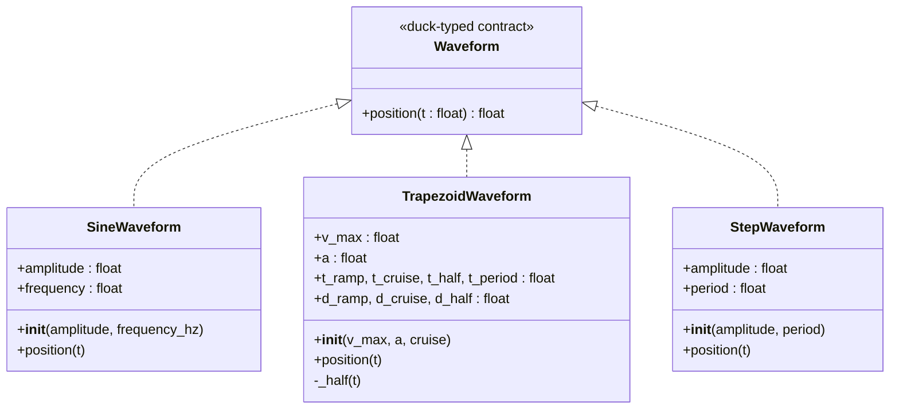

> **There is no `Waveform` base class in the source.** Python uses **duck typing** — the contract is just "has a `position(t)` method that returns a float." If you came from C++, picture a pure-virtual interface that's never written down because the language doesn't make you. The dotted inheritance arrows in the diagram represent *conformance to a duck-typed protocol*, not actual `class X(Y)` inheritance.

#### `SineWaveform` ([:127-135](../src/claude_visualizer/scripts/mock_robot_controller.py#L127-L135))

```python
class SineWaveform:
    """pos(t) = A · sin(2π·f·t)"""

    def __init__(self, amplitude: float, frequency_hz: float) -> None:
        self.amplitude = amplitude
        self.frequency = frequency_hz

    def position(self, t: float) -> float:
        return self.amplitude * math.sin(2.0 * math.pi * self.frequency * t)
```

The pattern: `__init__` stores the configuration; `position(t)` is pure math.

#### `TrapezoidWaveform` ([:138-166](../src/claude_visualizer/scripts/mock_robot_controller.py#L138-L166))

```python
class TrapezoidWaveform:
    """Symmetric trapezoidal velocity profile."""

    def __init__(self, v_max: float, a: float, cruise: float) -> None:
        self.v_max = v_max
        self.a = a
        self.t_ramp = v_max / a
        self.t_cruise = cruise
        self.t_half = self.t_ramp + cruise + self.t_ramp
        self.t_period = self.t_half * 2.0
        self.d_ramp = 0.5 * a * self.t_ramp ** 2
        self.d_cruise = v_max * cruise
        self.d_half = self.d_ramp + self.d_cruise + self.d_ramp

    def position(self, t: float) -> float:
        t_mod = math.fmod(t, self.t_period)
        if t_mod >= self.t_half:
            return self.d_half - self._half(t_mod - self.t_half)
        return self._half(t_mod)

    def _half(self, t: float) -> float:
        if t < self.t_ramp:
            return 0.5 * self.a * t ** 2
        t -= self.t_ramp
        if t < self.t_cruise:
            return self.d_ramp + self.v_max * t
        t -= self.t_cruise
        return self.d_ramp + self.d_cruise + self.v_max * t - 0.5 * self.a * t ** 2
```

Notice the precomputed derived attributes (`t_ramp`, `d_half`, etc.) — these are cached in `__init__` so `position(t)` stays cheap. The leading underscore on `_half` is a Python convention meaning "private by convention" (there is no `private` keyword).

#### `StepWaveform` ([:169-177](../src/claude_visualizer/scripts/mock_robot_controller.py#L169-L177))

```python
class StepWaveform:
    """Alternates between 0 and amplitude every half-period."""

    def __init__(self, amplitude: float, period: float) -> None:
        self.amplitude = amplitude
        self.period = period

    def position(self, t: float) -> float:
        return self.amplitude if math.fmod(t, self.period) >= self.period / 2.0 else 0.0
```

#### The factory ([:180-197](../src/claude_visualizer/scripts/mock_robot_controller.py#L180-L197))

```python
def build_waveform(name: str, cfg: dict):
    if name == "sine":
        return SineWaveform(cfg["sine_amplitude"], cfg["sine_frequency_hz"])
    if name == "trapezoid":
        return TrapezoidWaveform(cfg["trap_max_velocity"],
                                 cfg["trap_acceleration"],
                                 cfg["trap_cruise_time_s"])
    if name == "step":
        return StepWaveform(cfg["step_amplitude"], cfg["step_period_s"])
    raise ValueError(f"unknown waveform: {name!r} (use trapezoid|sine|step)")
```

ROS analogy: this is exactly like instantiating a controller plugin from a YAML name.

### 6.3 The telemetry loop ([:202-232](../src/claude_visualizer/scripts/mock_robot_controller.py#L202-L232))

```python
def telemetry_loop(outlet: pylsl.StreamOutlet, stop_event: threading.Event,
                   waveform, rate_hz: float) -> None:
    period = 1.0 / rate_hz
    t_last = time.monotonic()
    p_last = 0.0
    v_last = 0.0
    next_tick = t_last

    while not stop_event.is_set():
        now = time.monotonic()
        dt = now - t_last
        t_last = now

        p = waveform.position(time.time())
        v = (p - p_last) / dt if dt > 0 else 0.0
        a = (v - v_last) / dt if dt > 0 else 0.0
        p_last = p
        v_last = v

        outlet.push_sample([float(p), float(v), float(a)])

        next_tick += period
        sleep_for = next_tick - time.monotonic()
        if sleep_for > 0:
            time.sleep(sleep_for)
        else:
            next_tick = time.monotonic()
```

Four ideas in this loop, in order of subtlety:

1. **Two clocks, on purpose.**
   - `time.time()` (wall clock) is used to compute the *waveform phase* — so this process and `mock_encoder` produce the same value at the same instant, even when started at different moments.
   - `time.monotonic()` (steady clock) is used for `dt` — immune to NTP jumps and DST changes that would corrupt a numerical derivative.
2. **Numerical differentiation.** `v = dp/dt` and `a = dv/dt` from successive samples. Crude but fine at 500 Hz.
3. **Drift-free pacing.** `next_tick += period` (instead of `time.sleep(period)` on its own) prevents accumulated drift — if a tick runs late, the next one fires sooner to catch up. The `else: next_tick = time.monotonic()` clause resyncs if we fall hopelessly behind.
4. **Cooperative shutdown.** The loop checks `stop_event.is_set()` every iteration; the main thread will set this when it's time to exit.

### 6.4 Markers and the stdin REPL ([:289-314](../src/claude_visualizer/scripts/mock_robot_controller.py#L289-L314))

```python
try:
    for line in sys.stdin:
        cmd = line.strip().lower()
        if not cmd:
            continue

        if cmd == "start":
            counter += 1
            active_profile_id = f"cli_{counter:03d}"
            push_marker(mrk_outlet, "START", active_profile_id)
            print(f"[mock_robot_controller] START → {active_profile_id}", file=sys.stderr)

        elif cmd == "stop":
            if active_profile_id is None:
                print("[mock_robot_controller] (no active profile)", file=sys.stderr)
                continue
            push_marker(mrk_outlet, "STOP", active_profile_id)
            print(f"[mock_robot_controller] STOP  → {active_profile_id}", file=sys.stderr)
            active_profile_id = None

        elif cmd in ("quit", "exit", "q"):
            break
```

`for line in sys.stdin` blocks the **main thread** until the user types something and hits Enter. This is fine because the streaming work happens in the daemon `tel_thread` we started earlier.

### 6.5 Threading model — only two lanes

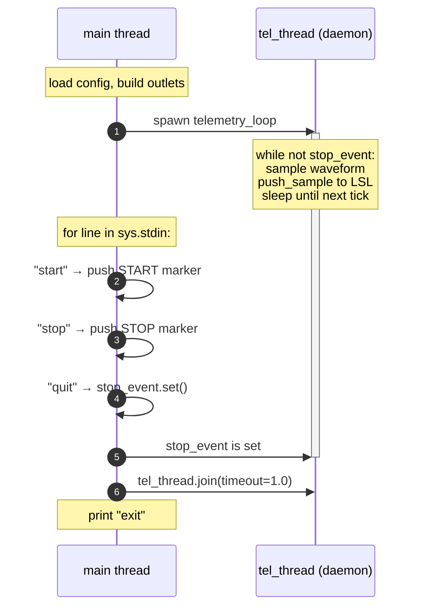

Daemon = "dies automatically when the main thread exits, no cleanup required." The `stop_event` exists for graceful shutdown so the tel_thread finishes its current loop iteration cleanly.

> **Try this.**
> 1. Add a class `RampWaveform` with `position(t) = slope * t`. Wire it into `build_waveform` and add a `ramp_slope` entry under the `mock_robot_controller` block in [params.yaml](../src/claude_visualizer/config/params.yaml). Confirm the line slopes upward in the browser. **You should not have to touch any other file.** That proves the LSL contract is the only public API surface of this script.
> 2. Drop `telemetry_rate_hz` from `500.0` to `50.0`. Predict before launching: same waveform shape, fewer points per second → the line looks more *staircase*-y in the browser, not a different curve.

---

## 7. Why `web_visualizer.py` needs threads at all

### The one-cook restaurant

Imagine a one-person restaurant. The cook can only do one task at a time. If they're stirring soup *and* a customer walks in, the customer waits. If three customers want food at once, two of them wait while the third gets cooked for. **A single-threaded program is exactly this restaurant** — one set of hands, one task at a time.

`web_visualizer.py` has four jobs that all want to "cook" at the same moment:

| Job | Why it can't wait its turn |
|---|---|
| Drive ROS subscription callbacks | A new ROS message can arrive at any moment |
| Run the WebSocket server | A browser can connect or disconnect at any moment |
| Pull samples from the LSL telemetry stream | Samples arrive ~500 times per second |
| Pull samples from the LSL marker stream | Markers arrive whenever the user types `start` |

One cook can't do this. So the bridge **hires four cooks** — four **threads** — and gives each one a single job.

### What does "blocking" mean?

A function "**blocks**" when it makes you wait. `time.sleep(2)` blocks for 2 seconds: your code sits there doing nothing.

Think of a phone call vs a text message:
- A phone call **blocks** you. While you're on it, you can't answer the door.
- A text message is **non-blocking**. You send it and keep doing other things until the reply arrives.

The bridge has three blocking phone calls that each demand their own person to hold the line:

1. **`rclpy.spin(node)`** at [web_visualizer.py:353](../src/claude_visualizer/scripts/web_visualizer.py#L353) is a phone call that *never hangs up*. It sits forever, waiting to deliver ROS messages to your `_on_*` callbacks. Whoever picks it up is occupied for the rest of the program's life. (You already trust this — you've called `rclpy.spin` at the bottom of every ROS Python node you've written.)
2. **`inlet.pull_sample(timeout=1.0)`** at [web_visualizer.py:267](../src/claude_visualizer/scripts/web_visualizer.py#L267) is a phone call that hangs up after 1 second if nothing comes in. Whoever calls it is stuck for that second.
3. **`websockets.serve(...)`** at [web_visualizer.py:196](../src/claude_visualizer/scripts/web_visualizer.py#L196) needs its own special "meeting room" called the **asyncio loop** (we'll meet it properly in §8). The room won't share a thread with `rclpy.spin`, because each of them wants exclusive control.

Three blocking jobs that each insist on owning a thread → three extra threads, one per job. Plus the main thread that started the program → **four threads total**.

### What is a thread?

A **thread** is one independent line of execution inside a program. Every Python program starts with one — the **main thread**. You can ask Python to start more by calling `threading.Thread(target=fn).start()`. After that, two pieces of code run *at the same time* — the same way two `ros2 run` commands in two terminals each run independently. You already understand the *idea* from ROS; threads just put that idea inside a single process.

### What does `daemon=True` mean?

When you create a thread you can mark it `daemon=True`. The word "**daemon**" here just means "**background helper**" — like a spell-checker running quietly inside your text editor.

The rule is one sentence:

- **A daemon thread dies the instant the main thread dies.** No farewell, no cleanup. Like turning off the office lights — every assistant in the room goes home automatically.
- A non-daemon thread, by contrast, *keeps the program alive* until it finishes — Python won't let you exit while a non-daemon worker is still running.

The bridge marks all three of its helper threads as daemons because they should die the moment Ctrl-C kills the ROS spin loop. Otherwise the program would hang forever waiting for them.

### The four threads, summarised

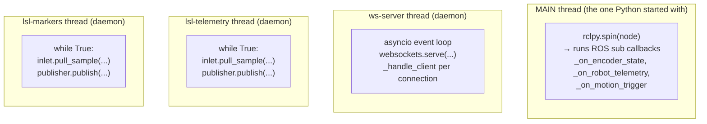

| Thread | Daemon? | Born at | Job, in plain words |
|---|---|---|---|
| `MAIN` | no (it *is* the main thread) | [:353](../src/claude_visualizer/scripts/web_visualizer.py#L353) | Listens for ROS messages, runs `_on_*` callbacks |
| `ws-server` | yes | [:145-148](../src/claude_visualizer/scripts/web_visualizer.py#L145-L148) | Runs the WebSocket "meeting room" (asyncio loop) |
| `lsl-telemetry` | yes | [:168-172](../src/claude_visualizer/scripts/web_visualizer.py#L168-L172) | Sits on the LSL phone waiting for telemetry samples |
| `lsl-markers` | yes | [:173-177](../src/claude_visualizer/scripts/web_visualizer.py#L173-L177) | Sits on the LSL phone waiting for marker events |

### Reading the thread setup, line by line

This is the eight-line block that creates the second thread. Read every line — every word in this snippet has a job to do:

```python
# web_visualizer.py:140-149
self._ws_clients = set()                         # an empty set — will hold connected browsers
self._ws_last_messages = {}                      # an empty dict — last message of each topic, so newcomers get a snapshot
self._ws_loop = asyncio.new_event_loop()         # build a fresh "meeting room" object (more in §8)
self._ws_ready = threading.Event()               # build a "starting pistol" — explained next
self._ws_thread = threading.Thread(              # build a thread object…
    target=self._run_ws_loop,                    #   …whose job is to call this method…
    daemon=True,                                 #   …as a background helper that dies with main…
    name="ws-server",                            #   …labelled "ws-server" so debuggers can show it.
)
self._ws_thread.start()                          # actually launch the thread (now two threads exist)
self._ws_ready.wait()                            # main thread STOPS HERE until the ws-server thread fires the pistol
```

A subtle point: `threading.Thread(...)` only **builds** a thread object — nothing runs yet. The thread doesn't actually exist in the OS until you call `.start()`. After `.start()`, two pieces of code are running in parallel: the main thread keeps going past line 148, and the new `ws-server` thread starts executing `self._run_ws_loop()`.

### The starting-pistol analogy: `Event.wait()` and `Event.set()`

A `threading.Event` is a **starting pistol** with two states: *not fired* and *fired*.

- **`event.wait()`** — "I refuse to move until I hear the pistol." The thread that calls `wait()` freezes in place.
- **`event.set()`** — "Bang." Everyone who's been waiting unfreezes immediately. The pistol stays fired forever (until you `event.clear()` it).

Why we need it here: the **main thread** is racing to set up subscriptions and publishers. The new **`ws-server` thread** is meanwhile trying to bind port 9090. We can't keep going on main until the WebSocket server is actually listening — otherwise the first thing main does might be to broadcast to a server that doesn't exist yet.

So:
- The main thread calls `self._ws_ready.wait()` and freezes.
- The ws-server thread sets up the loop, binds the port, then calls `self._ws_ready.set()` (we'll see this in §8).
- "Bang." Main unfreezes. Both threads are now running for real.

You'll see the *exact same pattern* later with `_stop_event` (the one you highlighted in the editor at line 261). That's the **shutdown** pistol — fired by `destroy_node()` to tell the worker threads "time to wrap up and go home." The workers' `while not self._stop_event.is_set():` loop notices the bang and exits cleanly.

### The hand-off problem (and why we need `run_coroutine_threadsafe`)

We now have four threads, each minding its own job. But they need to **pass messages to each other**. Concretely: when the `lsl-telemetry` thread receives a sample, the data must end up on every connected browser's screen. Browsers live inside the **`ws-server` thread's meeting room** (the asyncio loop). The lsl-telemetry thread is a stranger to that room.

#### The office-memo analogy

Picture four employees in different rooms of an office. Three of them have memos that need to be delivered to the conference room. They can't just walk in and start talking — the conference room has its own etiquette: one person speaks at a time, and the moderator runs a strict agenda. Barging in would interrupt whoever's speaking and corrupt the notes.

So the outsiders **slide their memos under the door**, into a tray that the conference-room moderator picks up at the next break.

The function that "slides things under the door" is called `asyncio.run_coroutine_threadsafe(...)`. Read its name like English:

- **`asyncio`** — "this belongs to the asyncio library."
- **`run_coroutine`** — "run this special async function" (we'll meet coroutines properly in §8 — for now, picture them as memos written in a language only the conference room understands).
- **`_threadsafe`** — "...and it's safe to do this from a *different* thread." Without `_threadsafe`, the call would scribble on the room's notes and corrupt them.

Read the whole name as a sentence: *"Hey asyncio: please schedule this coroutine to run on this loop, and it's OK that I'm calling from outside the room."*

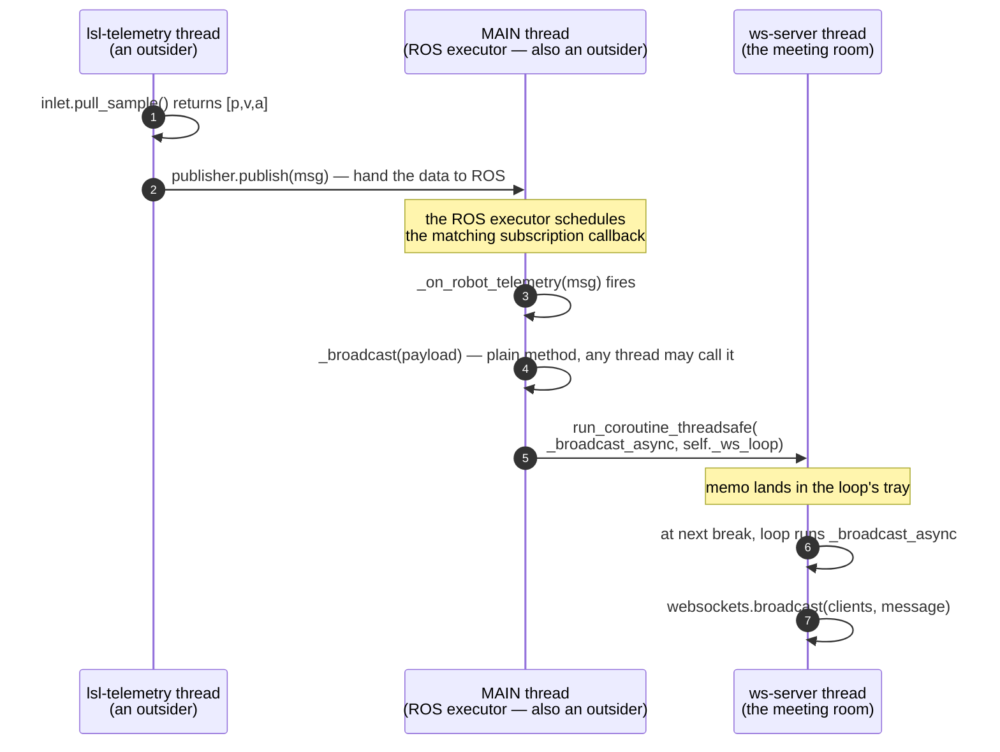

### Reading `_broadcast` line by line

Now look at the actual code, with every line annotated:

```python
# web_visualizer.py:214-225
def _broadcast(self, payload: dict) -> None:                 # plain (non-async) method, callable from any thread
    """Thread-safe: called from ROS/LSL threads. Pushes JSON to all clients."""
    message = json.dumps(payload)                            # turn the Python dict into a JSON string for the wire
    self._ws_last_messages[payload["topic"]] = message       # remember the latest, so a brand-new browser gets a snapshot
    if self._ws_clients:                                     # nobody connected? then nobody to broadcast to — skip
        asyncio.run_coroutine_threadsafe(                    # slide the memo under the door…
            self._broadcast_async(message),                  #   …the memo is "run this coroutine"…
            self._ws_loop,                                   #   …addressed to this specific meeting room.
        )

async def _broadcast_async(self, message: str) -> None:      # an async function — only the meeting room can run it
    if self._ws_clients:                                     # still anyone there?
        websockets.broadcast(self._ws_clients, message)      # send the same message to every connected browser
```

If you remember **one thing** from this whole file, remember this: `run_coroutine_threadsafe` is the legal way to step from a normal thread into the asyncio room. Every cross-thread hand-off in the bridge goes through it.

---

## 8. `asyncio` in just enough depth to read this file

### The meeting-room analogy

Forget `asyncio` for a moment. Picture a **single meeting room** with one whiteboard and one moderator. People (tasks) take turns speaking. Here's the trick: when a speaker has to pause — *"let me check my email, I'll be right back"* — the moderator says *"great, sit down. Next person speaks while you check."* When the speaker is ready, they get back in line. Nobody is interrupted; everyone yields voluntarily.

That meeting room is an **asyncio event loop**.
The speakers are **coroutines**.
The "let me check my email" pause is **`await`**.

The whole point of the room: **only one speaker is talking at any moment, but nobody is ever blocked waiting on slow I/O** — they just sit down and let someone else go.

### The five words you need to know

Each definition is anchored to the meeting-room picture above.

**`async def foo(): ...`** — the keyword `async` in front of `def` means "this is **not a normal function**; it's a coroutine." Calling `foo()` does NOT run the function body — it returns an *intent to run*, like writing your name on the speakers' list at the meeting. Until the moderator calls you up, nothing happens.

**coroutine** — the noun for what `async def` produces. A coroutine is a chunk of code that knows how to **pause itself** in the middle and resume later. Plain functions can't do that.

**`await something`** — read this as "**pause me here, and wake me back up when `something` is done.**" During the pause, the moderator runs other speakers. The catch: you can only write `await` *inside* an `async def`. Outside, Python rejects it with a syntax error.

**event loop** — the moderator. A Python object (here `self._ws_loop`) that keeps a queue of coroutines and decides who runs next. There is exactly one of these per meeting room. The bridge has one event loop, living on the `ws-server` thread.

**`asyncio.run_coroutine_threadsafe(coro, loop)`** — the only **legal back door** into the meeting room from outside. We met this in §7. It slides a coroutine onto the loop's queue from any thread.

Two more words you'll see used once each:

**`loop.run_until_complete(coro)`** — "open the meeting, run *just this one task* to completion, then pause." We use this once at startup so the WebSocket server is bound before we say "ready."

**`loop.run_forever()`** — "open the meeting and keep it running until I say stop." This is the asyncio cousin of `rclpy.spin`.

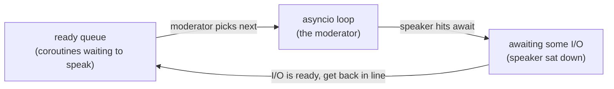

### Why use this instead of threads everywhere?

You're going to ask: "if `asyncio` runs one thing at a time, why not use threads for *everything*?"

Threads are great when each job is doing real work (computation, blocking I/O). They're expensive when each job is *mostly waiting* — say, 1000 idle WebSocket connections that occasionally send a frame. 1000 threads = 1000 stacks in memory + a lot of OS bookkeeping. 1000 coroutines on one loop = a single thread holding a list of suspended functions, almost free. The `websockets` library is built for the second case, which is why it requires asyncio.

### Reading `_run_ws_loop` line by line

This is the four-line entry point of the entire asyncio world. It runs on the new `ws-server` thread we created in §7.

```python
# web_visualizer.py:189-193
def _run_ws_loop(self) -> None:                       # plain method; runs on the ws-server thread
    asyncio.set_event_loop(self._ws_loop)             # tell asyncio "this thread's meeting room is THIS loop"
    self._ws_loop.run_until_complete(                 # open the meeting…
        self._start_ws_server()                       #   …run this one setup coroutine until it finishes…
    )
    self._ws_ready.set()                              # …fire the starting pistol so __init__ on main can continue
    self._ws_loop.run_forever()                       # then keep the meeting open forever (handle clients)
```

Reading the whole function as English: *"On this thread, install this loop. Run the setup coroutine to completion (that binds port 9090). Then fire the pistol so the main thread knows we're ready. Then keep moderating forever."*

### Reading `_start_ws_server` line by line

```python
# web_visualizer.py:195-198
async def _start_ws_server(self) -> None:             # async = coroutine; only the loop can run it
    self._ws_server = await websockets.serve(         # await = "pause until the server is bound"
        self._handle_client,                          #   ← the coroutine to run for each new browser
        self._ws_host,                                #   ← bind address ("0.0.0.0" — see §4)
        self._ws_port,                                #   ← port number (9090 by default)
    )
```

Note what `websockets.serve(...)` does: it's an async call, so it returns a coroutine, not a server object. The `await` says *"let me pause while it's binding, wake me when the listener is ready."* When that pause ends, the coroutine assigns the resulting server to `self._ws_server`, then returns. `_run_ws_loop` notices the setup coroutine finished, fires `_ws_ready`, and slides into `run_forever`.

### Reading `_handle_client` line by line

This is the per-browser coroutine. The loop runs **one copy of it for each connected browser tab**. If three browsers are open, three copies of `_handle_client` are taking turns in the meeting room.

```python
# web_visualizer.py:200-212
async def _handle_client(self, websocket) -> None:    # called by the loop EVERY time a new browser connects
    # Send the cached snapshot so the page isn't blank on connect.
    for cached in self._ws_last_messages.values():    # for each topic's last-known JSON…
        await websocket.send(cached)                  #   …send it; pause if the OS buffer fills, resume when it drains
    self._ws_clients.add(websocket)                   # remember this client so _broadcast can find it later
    try:
        async for _ in websocket:                     # "async for" = a pause-and-wait iterator;
            pass                                      #   yields once per message FROM the browser. We ignore them.
    except websockets.ConnectionClosed:               # the browser tab closed or lost network
        pass
    finally:
        self._ws_clients.discard(websocket)           # always remove, even on error
```

Two pieces of new syntax to call out explicitly:

**`await websocket.send(cached)`** — `send` is async because the OS network buffer might be full ("the mailbox is stuffed"). Instead of holding up the whole meeting room, the coroutine sits down (`await`) and lets other coroutines speak until the mailbox has room. Then it picks up where it left off and finishes sending.

**`async for _ in websocket:`** — read this as "**every time a message arrives from this browser, run the loop body once**." The underscore `_` is the conventional Python name for "I don't care about this value." We don't care because the dashboard never sends anything *to* us — it only receives. (See [§12](#12-stretch-exercises) exercise 4 for what changes if you start caring.)

### WebSocket lifecycle — full sequence

The diagram below shows all four phases end-to-end. Blue arrows are actions
the **script** initiates; the library and OS react to them. Green arrows are
actions the **`websockets` library** initiates autonomously in response to OS
events — your code is just the callback.

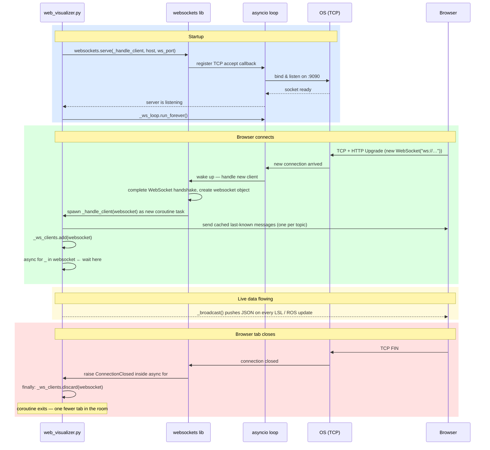

The key take-away: **`websockets.serve` is the only place your script hands
control to the library.** After that call, every connection event, handshake,
and `_handle_client` invocation is driven by the library — your code just
sits in the green and yellow phases waiting to be called.

### Now re-read `_broadcast` and `_broadcast_async`

Go back to the snippet at the end of §7. Read it again. Every word should now mean something concrete:

| Token | Meaning in this code |
|---|---|
| `def _broadcast` | a normal method — any thread may call it |
| `json.dumps(payload)` | turn the dict into a JSON string for the WebSocket wire |
| `if self._ws_clients:` | "is anyone in the meeting?" |
| `run_coroutine_threadsafe(...)` | slide the memo under the door |
| `async def _broadcast_async` | a coroutine — only the loop can run it |
| `websockets.broadcast(self._ws_clients, message)` | send the same JSON string to every connected browser |

> **Try this.** At the top of `_handle_client`, add `print(f"client connected from {websocket.remote_address}")`. Reload the dashboard a few times — you'll see one print per connection. Now make it `time.sleep(5); print(...)`. Reload one tab — *every other tab freezes for 5 seconds too*, because `time.sleep` is a blocking phone call inside the meeting room. Replace `time.sleep(5)` with `await asyncio.sleep(5)` — now reloads are independent again, because `asyncio.sleep` knows how to sit down and yield. **That single change is the whole point of asyncio.**

---

## 9. Reading `web_visualizer.py` end-to-end

With threading and asyncio under your belt, the file reads top-to-bottom without surprises.

### 9.1 JSON serializers ([:63-105](../src/claude_visualizer/scripts/web_visualizer.py#L63-L105))

ROS messages are not JSON-serializable out of the box. Three small functions convert them, with `header.stamp` flattened to a float second. The wire format is documented at [:23-25](../src/claude_visualizer/scripts/web_visualizer.py#L23-L25):

```
{"topic": "encoder_state" | "robot_telemetry" | "motion_trigger",
 "data": { ...fields from the ROS msg... }}
```

Skim these three functions. When you add a new field to a `.msg`, you add it here too.

### 9.2 Parameters and QoS ([:115-138](../src/claude_visualizer/scripts/web_visualizer.py#L115-L138))

Standard `declare_parameter` calls — you've seen these in every ROS node. The only quirk is the parameter `rosbridge_port` which is a *legacy name* meaning "WebSocket port" (no `rosbridge_server` package is involved). The QoS profile is a vanilla RELIABLE/KEEP_LAST(10).

### 9.3 WebSocket server bootstrap ([:140-149](../src/claude_visualizer/scripts/web_visualizer.py#L140-L149))

Already covered in [§7](#7-why-web_visualizerpy-needs-threads-at-all) and [§8](#8-asyncio-in-just-enough-depth-to-read-this-file).

### 9.4 The four flows mapped to method names

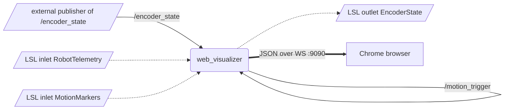

**Self-loops** on `/robot_telemetry` and `/motion_trigger` are not a typo — the node publishes them *and* subscribes to them. Why is the topic of the next subsection.

### 9.5 The "publish-then-subscribe-yourself" pattern ([:159-164](../src/claude_visualizer/scripts/web_visualizer.py#L159-L164))

```python
# Also subscribe to these topics so that ANY publisher (our LSL worker
# OR mock_encoder OR a future robot_controller ROS node) gets
# broadcast to the WebSocket clients. LSL workers therefore do NOT
# broadcast directly — the subscription callbacks do.
self.create_subscription(RobotTelemetry, topic_telemetry, self._on_robot_telemetry, qos)
self.create_subscription(MotionTrigger,   topic_trigger,  self._on_motion_trigger,  qos)
```

The reasoning: imagine the real robot controller (Phase 4) starts publishing `/robot_telemetry` directly over ROS without going through LSL. With this pattern, *any* publisher of that topic ends up on the browser — the bridge doesn't care where the data came from. It's a clean fan-out: ROS subscription is the single broadcast trigger.

### 9.6 Flow 1 — ROS → LSL outlet

```python
# web_visualizer.py:229-242
def _make_encoder_state_outlet(self) -> pylsl.StreamOutlet:
    info = pylsl.StreamInfo(
        name="EncoderState",
        type="Kinematics",
        channel_count=len(ENCODER_STATE_CHANNELS),
        nominal_srate=pylsl.IRREGULAR_RATE,
        channel_format=pylsl.cf_float32,
        source_id="claude_visualizer_encoder_state",
    )
    channels = info.desc().append_child("channels")
    for label in ENCODER_STATE_CHANNELS:
        ch = channels.append_child("channel")
        ch.append_child_value("label", label)
    return pylsl.StreamOutlet(info)

def _on_encoder_state(self, msg: EncoderState) -> None:
    self._encoder_state_outlet.push_sample(
        [float(msg.position), float(msg.velocity), float(msg.acceleration)],
        timestamp=_stamp_to_sec(msg.header.stamp),
    )
    self._broadcast(encoder_state_to_json(msg))
```

The callback does two things: push the sample to LSL (so external non-ROS consumers can read the Kalman-filtered state) and broadcast the JSON to the browser. Note the explicit `timestamp=` kwarg on `push_sample` — we forward the original ROS header timestamp instead of letting LSL stamp it on arrival.

### 9.7 Flows 2 and 3 — LSL → ROS

The two LSL worker threads ([:259-287](../src/claude_visualizer/scripts/web_visualizer.py#L259-L287) and [:291-321](../src/claude_visualizer/scripts/web_visualizer.py#L291-L321)) are nearly identical. The only differences are:

- Telemetry pulls 3 floats; markers pull 1 string and parse it as JSON.
- Both rebuild their inlet on error (`inlet = None; continue`) so a transient LSL failure self-heals.
- Both publish to a ROS topic — they do **not** broadcast to WebSocket directly. The corresponding ROS subscription callback ([:251-255](../src/claude_visualizer/scripts/web_visualizer.py#L251-L255)) does that.

Read both side-by-side; the pattern is `resolve → pull → validate → build msg → publish`.

### 9.8 Flow 4 — broadcast to the browser

Already covered in [§7](#the-cross-thread-hand-off) and [§8](#8-asyncio-in-just-enough-depth-to-read-this-file). One detail worth re-noting from `_handle_client` ([:200-212](../src/claude_visualizer/scripts/web_visualizer.py#L200-L212)): when a new browser connects, it immediately receives the *cached* most-recent message for each topic. This is why a tab opened mid-experiment isn't blank — it gets a snapshot, then live updates.

### 9.9 Shutdown ([:338-346](../src/claude_visualizer/scripts/web_visualizer.py#L338-L346))

```python
def destroy_node(self):
    self._stop_event.set()
    for t in self._threads:
        t.join(timeout=1.5)
    try:
        self._ws_loop.call_soon_threadsafe(self._ws_loop.stop)
    except Exception:
        pass
    super().destroy_node()
```

Textbook multi-thread teardown:

1. Signal the LSL workers (`_stop_event.set()`) and wait briefly for them to notice.
2. Schedule `loop.stop` from another thread via `call_soon_threadsafe` — same problem as `run_coroutine_threadsafe`, smaller hammer.
3. Let the parent class do its ROS-side cleanup.

---

## 10. One sample's journey: end-to-end sequence

This is the diagram to memorise. One position sample from the trapezoid generator, all the way to a pixel in your browser:

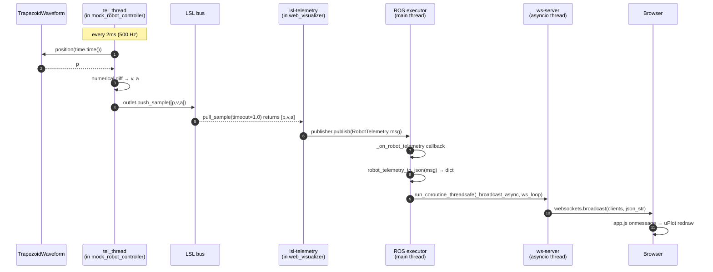

Each numbered arrow, with the file:line you can jump to:

| # | What happens | Where |
|---|---|---|
| 1 | `waveform.position(time.time())` | [mock_robot_controller.py:219](../src/claude_visualizer/scripts/mock_robot_controller.py#L219) |
| 2 | trapezoid math returns `p` | [mock_robot_controller.py:153](../src/claude_visualizer/scripts/mock_robot_controller.py#L153) |
| 3 | `v = (p - p_last)/dt`, then `a` | [:220-221](../src/claude_visualizer/scripts/mock_robot_controller.py#L220-L221) |
| 4 | `outlet.push_sample([p,v,a])` | [:225](../src/claude_visualizer/scripts/mock_robot_controller.py#L225) |
| 5 | `inlet.pull_sample(timeout=1.0)` returns the sample | [web_visualizer.py:267](../src/claude_visualizer/scripts/web_visualizer.py#L267) |
| 6 | `publisher.publish(msg)` on `/robot_telemetry` | [web_visualizer.py:286](../src/claude_visualizer/scripts/web_visualizer.py#L286) |
| 7 | `_on_robot_telemetry` ROS callback fires | [web_visualizer.py:251](../src/claude_visualizer/scripts/web_visualizer.py#L251) |
| 8 | `robot_telemetry_to_json(msg)` builds the JSON dict | [web_visualizer.py:83-92](../src/claude_visualizer/scripts/web_visualizer.py#L83-L92) |
| 9 | `run_coroutine_threadsafe` hands off to asyncio | [web_visualizer.py:218-221](../src/claude_visualizer/scripts/web_visualizer.py#L218-L221) |
| 10 | `websockets.broadcast(clients, message)` writes to every TCP socket | [web_visualizer.py:223-225](../src/claude_visualizer/scripts/web_visualizer.py#L223-L225) |
| 11 | `onmessage` handler pushes the point into uPlot's buffer; the 30 Hz redraw timer paints it | [web/app.js](../web/app.js) |

End-to-end latency on a quiet machine is well under 10 ms. Any time something goes wrong, point at the diagram and ask "which arrow stopped firing?"

---

## 11. Run it, change it, debug it

### 11.1 Three-terminal run, no launch file

When something is broken, isolate failures by starting each piece by hand:

```bash
# Terminal 1 — the bridge
ros2 run claude_visualizer web_visualizer.py --ros-args \
  --params-file src/claude_visualizer/config/params.yaml

# Terminal 2 — the synthetic LSL publisher
python3 src/claude_visualizer/scripts/mock_robot_controller.py --waveform sine

# Terminal 3 — serve the static frontend
cd web && python3 -m http.server 8000
```

Then open `http://localhost:8000` in a browser. You should see the live plots.

### 11.2 Full launch (Phase 1 + Phase 2)

[launch/bringup.launch.py](../src/claude_visualizer/launch/bringup.launch.py) starts `mock_encoder`, `Kalman_filter`, and `web_visualizer` together (it does **not** start `mock_robot_controller` — you still need to run that separately):

```bash
ros2 launch claude_visualizer bringup.launch.py
ros2 launch claude_visualizer bringup.launch.py waveform:=sine
```

### 11.3 Diagnostic checklist

| Symptom | First thing to check | Why |
|---|---|---|
| Browser says "Disconnected" | `ss -tlnp \| grep 9090` — is the bridge listening? | If empty, the WS server failed to bind (bridge crashed, or port in use). |
| Bridge logs `LSL stream 'RobotTelemetry' not found — will keep retrying` | Is `mock_robot_controller` actually running? | LSL discovery is LAN multicast — multicast disabled or two networks split → no resolution. |
| `ros2 topic echo /robot_telemetry` is silent but the plot wiggles | Did the LSL worker thread die? Look for warnings in bridge logs. | Worker may have crashed on a JSON parse error and stopped publishing. |
| `OSError: [Errno 98] Address already in use` on port 9090 | `pkill -f web_visualizer` to kill the zombie | An old bridge process still owns the port. |
| Browser connects but shows no data | Open Chrome DevTools → Network → WS → click the connection → Frames | If you see frames arriving but no plot updates, the JSON shape changed and `app.js` is choking. |

### 11.4 The marker REPL walkthrough

In the `mock_robot_controller` terminal, type:

```
> start
[mock_robot_controller] START → cli_001
> stop
[mock_robot_controller] STOP  → cli_001
> quit
[mock_robot_controller] exit
```

Each `start`/`stop` pushes one JSON marker through LSL → `web_visualizer` → `/motion_trigger` → WebSocket → browser, where the profile panel toggles state. The exact JSON payload schema is at [mock_robot_controller.py:237-245](../src/claude_visualizer/scripts/mock_robot_controller.py#L237-L245).

### 11.5 Use `ros2 topic echo` as your first debug tool

The data the browser plots is the *exact* same data on `/robot_telemetry`, just before the JSON conversion. So:

```bash
ros2 topic echo /robot_telemetry
ros2 topic echo /motion_trigger
ros2 topic echo /encoder_state
```

If these are quiet, the failure is upstream (LSL worker, mock_robot_controller). If they're flowing but the browser is blank, the failure is downstream (WebSocket broadcast or the frontend JS).

---

## 12. Stretch exercises

In increasing difficulty. Each one targets a different layer of the system.

1. **(OOP)** Add a `ChirpWaveform` whose frequency increases linearly with time: `pos(t) = A · sin(2π · (f0 + k·t) · t)`. Wire it through `build_waveform` ([:180](../src/claude_visualizer/scripts/mock_robot_controller.py#L180)) and add a block to [params.yaml](../src/claude_visualizer/config/params.yaml). Touches **only** `mock_robot_controller.py` + `params.yaml` — proves the LSL contract is the only public interface.

2. **(LSL schema change)** Add a `cmd_jerk` (third derivative) channel. You'll need to touch:
   - [mock_robot_controller.py](../src/claude_visualizer/scripts/mock_robot_controller.py) — channel count in `build_telemetry_outlet`, push `[p, v, a, j]`.
   - The `RobotTelemetry.msg` definition.
   - [web_visualizer.py:58](../src/claude_visualizer/scripts/web_visualizer.py#L58) `TELEMETRY_CHANNELS`.
   - The JSON serializer at [:83-92](../src/claude_visualizer/scripts/web_visualizer.py#L83-L92).
   - The worker's channel-count check at [:274-278](../src/claude_visualizer/scripts/web_visualizer.py#L274-L278).
   - Maybe the frontend if you want to plot it.

   This exercise maps "what changes when the wire schema changes."

3. **(ROS topic)** Add a new topic `/error_state` that the bridge subscribes to and broadcasts as JSON. Mirror the `_on_robot_telemetry` pattern. Touches the JSON serializers, `__init__`, and a new callback.

4. **(Asyncio)** Make the bridge accept `{"command":"pause"}` from the browser and stop broadcasting until `{"command":"resume"}` arrives. The unused `async for _ in websocket:` at [web_visualizer.py:207](../src/claude_visualizer/scripts/web_visualizer.py#L207) becomes a real receive loop. Hint: keep a `self._paused: bool` flag and check it in `_broadcast`.

5. **(Threading)** Add backpressure: if a slow client can't keep up, drop frames instead of blocking the broadcast. Replace `websockets.broadcast` with a per-client `asyncio.Queue` (max size 10) and one consumer coroutine per client. If the queue is full on `put_nowait`, drop the oldest frame.

6. **(Networking)** Make the bridge serve the static files in `web/` itself on port 8000, eliminating the separate `python3 -m http.server`. Two options: a fourth thread running `http.server`, or replace `websockets` with `aiohttp` and have one app handle both HTTP routes and WebSocket upgrades. Discussion: which port should host both? (Answer: combining static files + WS on a single port via aiohttp is the common production pattern, but the current split is simpler to debug.)

---

## Appendix A — Cheat-sheet card

**The 4 data flows** (all in [web_visualizer.py:6-22](../src/claude_visualizer/scripts/web_visualizer.py#L6-L22)):

| # | From | To | Glue method |
|---|---|---|---|
| 1 | ROS `/encoder_state` | LSL outlet `EncoderState` + WS | `_on_encoder_state` ([:244](../src/claude_visualizer/scripts/web_visualizer.py#L244)) |
| 2 | LSL inlet `RobotTelemetry` | ROS `/robot_telemetry` (then WS) | `_telemetry_worker` ([:259](../src/claude_visualizer/scripts/web_visualizer.py#L259)) |
| 3 | LSL inlet `MotionMarkers` | ROS `/motion_trigger` (then WS) | `_marker_worker` ([:291](../src/claude_visualizer/scripts/web_visualizer.py#L291)) |
| 4 | ROS subs of (1–3) | WebSocket clients | `_broadcast` ([:214](../src/claude_visualizer/scripts/web_visualizer.py#L214)) |

**The 4 threads:**

| Name | Job | Started at | Lifetime |
|---|---|---|---|
| MAIN | `rclpy.spin` | [:353](../src/claude_visualizer/scripts/web_visualizer.py#L353) | Foreground |
| `ws-server` | asyncio loop, `websockets.serve` | [:145-148](../src/claude_visualizer/scripts/web_visualizer.py#L145-L148) | daemon |
| `lsl-telemetry` | `pull_sample` → publish to `/robot_telemetry` | [:168-172](../src/claude_visualizer/scripts/web_visualizer.py#L168-L172) | daemon |
| `lsl-markers` | `pull_sample` → publish to `/motion_trigger` | [:173-177](../src/claude_visualizer/scripts/web_visualizer.py#L173-L177) | daemon |

**The 4 ports/streams:**

| Identity | Owner | Direction |
|---|---|---|
| TCP port 9090 | `web_visualizer.py` | WebSocket server |
| TCP port 8000 | `python3 -m http.server` | static HTML/JS |
| LSL stream `RobotTelemetry` | `mock_robot_controller` | outlet |
| LSL stream `MotionMarkers` | `mock_robot_controller` | outlet |
| LSL stream `EncoderState` | `web_visualizer` | outlet (Flow 1) |

**5 "if you change X, also change Y" pairs:**

| If you change… | …also change |
|---|---|
| Channel count in `build_telemetry_outlet` | `TELEMETRY_CHANNELS` in `web_visualizer.py`, the `.msg`, the JSON serializer, the channel-count check |
| `rosbridge_port` in `params.yaml` | `WS_URL` in `web/app.js` |
| LSL stream `name=` in an outlet | `lsl_*_stream_name` parameter the bridge resolves by |
| The JSON envelope at `web_visualizer.py:23-25` | The `switch (msg.topic)` block in `web/app.js` |
| `MotionTrigger.msg` fields | Both the `marker_worker` parser and `motion_trigger_to_json` |

---

## Appendix B — Glossary

- **asyncio loop** — single-threaded cooperative scheduler for coroutines.
- **coroutine** — function declared with `async def`; calling it returns an awaitable, not a value.
- **daemon thread** — a Python thread that dies automatically when the main thread exits.
- **duck typing** — Python's "if it has the right method, that's good enough" approach to interfaces (no formal `interface` keyword).
- **event loop** — same as asyncio loop.
- **frontend** — code that runs in the browser; here, the files in [web/](../web/).
- **future** — a placeholder for a value that will be available later. `concurrent.futures.Future` (threads) and `asyncio.Future` (coroutines) are different but analogous.
- **HTTP** — request/response protocol; one round-trip per question.
- **`IRREGULAR_RATE`** — LSL constant signalling "this stream has no fixed rate; samples arrive whenever."
- **LSL inlet/outlet** — non-ROS pub/sub primitives; outlets advertise on the LAN, inlets discover by name.
- **monotonic clock** — `time.monotonic()`; never goes backward, immune to NTP and DST.
- **multicast discovery** — how LSL finds streams on the LAN without a central server.
- **port** — OS-level identifier for a TCP listener; two processes can't share one.
- **`run_coroutine_threadsafe`** — the only safe way to schedule a coroutine onto a loop running in a different thread.
- **thread-safe** — callable from any thread without locks; `_broadcast` is the canonical example here.
- **WebSocket** — a persistent two-way connection that starts as an HTTP upgrade and then carries arbitrary frames.
